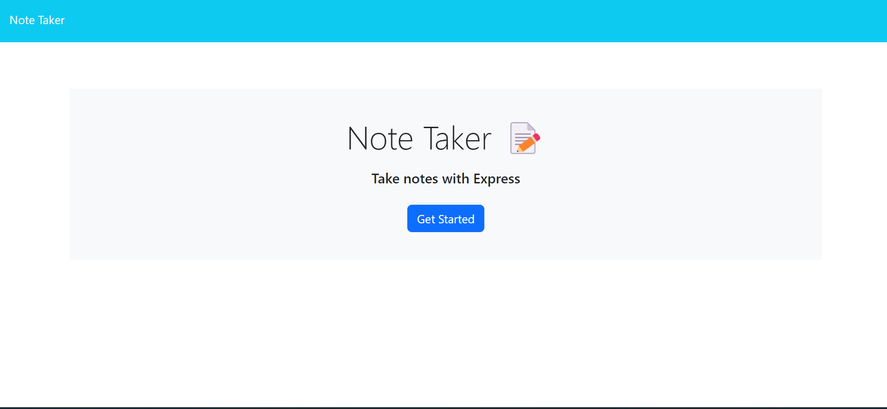
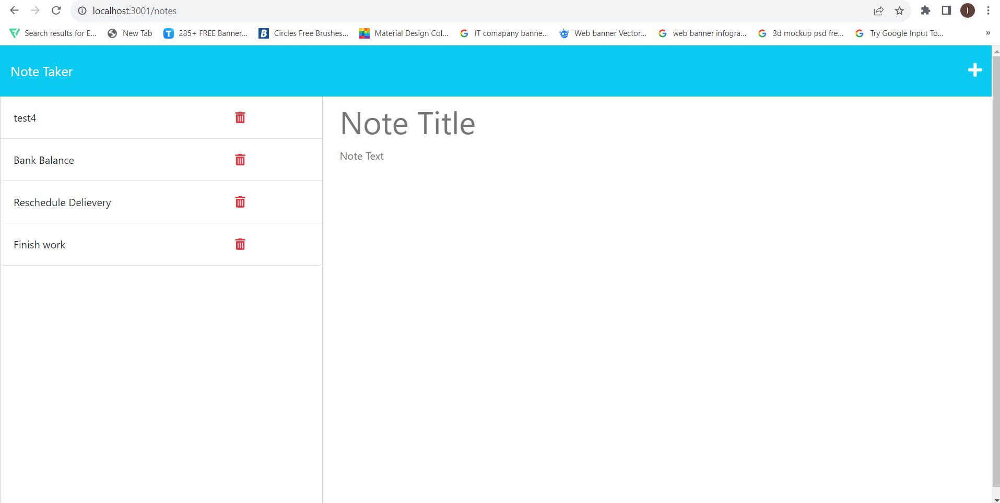
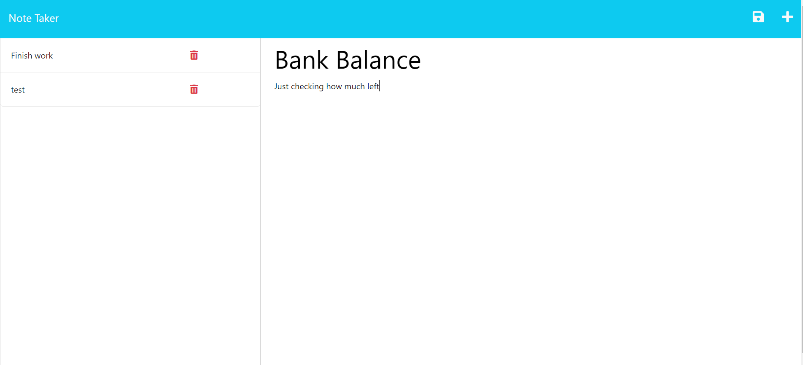

# note-taker

## Description
This is application note taker.During our busy life , we can create our notes  which includes title and description. we can delete any time if we doen want it. but first of all ,we need some dependiences ,which need to install like npm init, express, nodemon(which is optional just easy to make check in terminal) 

# github Repo Link
git@github.com:LipikaManglaa/note-taker.git

## video Link
https://drive.google.com/file/d/1lwYuY9gzSmzS7aFSSFnUCTEy51sR2hPl/view

## Table of Contents

  
* [Description](#Description)

* [Screenshots](#Screenshots) 

* [Installation](#installation)
  
* [Instructions](#Instructions) 
          
* [Questions](#questions)
 
* [Usage](#usage)

* [License](#license)          

## Installation
1. In order to install this project you must clone this project on to your local machine.

2.  use the command "npm init -y" in the terminal to create a package.json file for storing project files

3. To install express using the terminal, npm i express for installing express.

4. Using the terminal, run "npm i nodemon" to install the application's dependencies.

5. Type "node server.js" in the terminal to run the application or you can use nodemon server.js

## Usage
This project usage is for anyone that needs a note taker to amke easy life

## Instructions
If you would like to see how to create  then you can check my github repo and let you know  how to cretae it

## Screenshots 
 example of note taker

  

  

  

## License
This application is covered under the MIT license

## Questions
Created by: LipikaManglaa

If you have any further questions please feel free to contact me at lipika.mangla.web@gmail.com